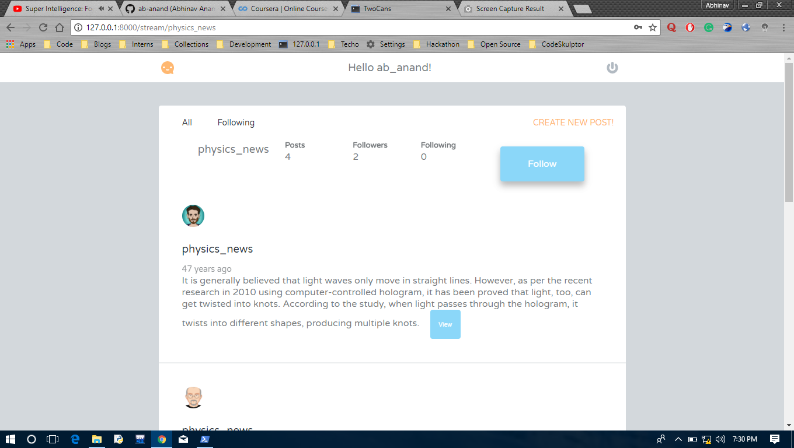

# The-Social-Network

This website is a mini Social Network implementation in Flask. Very similar to twitter in earlier days.
It uses Flask, Peewee and Jinja2 templating.

## Features present 

- [x] Create a post
- [x] Read others' post with signup or login
- [x] Follow/unfollow someone
- [x] Can view a particular post
- [x] Get a random avatar

## Further Modifications planned
- [ ] Uploading their own avatar.
- [ ] Blocking a user
- [ ] See first
- [ ] Delete a post

### Credits - Teamtreehouse
